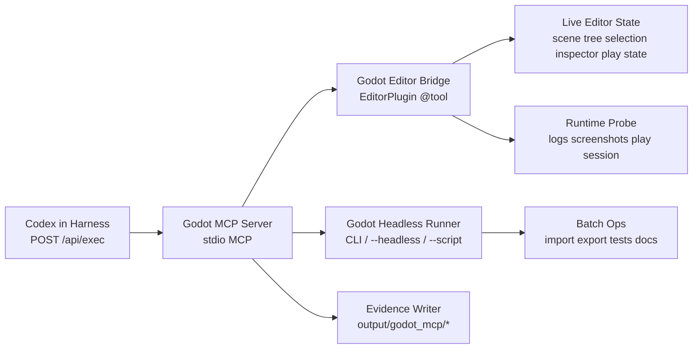

# Godot MCP Server 外洋設計

Updated: 2026-04-14

Authority role: `proposal / integration design`
Authority registry: `authority-registry.v1`

## 1. 目的

この設計の目的は、Codex が Godot プロジェクトを「ファイルをいじるだけ」でなく、**Editor の現在状態を理解し、Scene を安全に編集し、実行結果を観測し、import/export/test まで一気通貫で扱える**ようにすることです。

この repo の制約は維持します。

- 標準実行ルートは `POST /api/exec` のまま
- eval / release judgment は `POST /api/eval/run` のまま
- `/api/batch/*` 以外の独自ローカルオーケストレーション経路は増やさない
- 既定ポート `57525` は維持
- local-first を維持

したがって Godot 連携は、ハーネスの主役 API を増やすのではなく、**Codex が使う追加 MCP server** として設計します。

## 2. 成功条件

実装着手前の acceptance checks を先に固定します。

1. Codex が Godot project を開いたとき、開いている scene、selection、node tree、resource 状態、editor log を user の手入力なしで取得できる。
2. Codex が scene/node/property/script を編集でき、その変更が transaction として dry-run、apply、rollback のいずれかで扱える。
3. Codex が `play`, `stop`, `headless import`, `export`, `test/script run` を実行でき、結果を log・artifact・screenshot 付きで回収できる。
4. destructive 操作は project root に閉じ、local-only token と explicit mutation mode で保護される。
5. Godot 連携を入れても、この repo の public contract は変わらない。`/api/exec` と `/api/eval/run` が主役のまま。
6. read-only 操作だけでも十分に価値があり、phase 1 の時点で「今 Godot がどうなっているか分からない」状態を解消する。
7. 実行結果は evidence として残る。少なくとも request、tool call、before/after snapshot、log、error、timing を保存する。

## 3. ベンチマークと超え方

### A. filesystem-only 型

強み:

- 実装が単純
- script / scene file の生成や差分は強い
- headless CI に乗せやすい

弱み:

- Editor の現在状態が見えない
- selection / unsaved scene / open tab / play state が分からない
- 「今の Godot に何が起きているか」を AI が把握できない

この設計で超える点:

- `EditorPlugin` 経由で live editor state を取得する
- current scene tree、selection、play state、inspector target を resource として expose する

### B. headless CLI-only 型

強み:

- deterministic
- import / export / batch conversion / CI 向き
- window を必要としない

弱み:

- live editing には弱い
- scene selection や inspector 操作は扱えない
- user が編集中の Editor 状態を壊しやすい

この設計で超える点:

- live editor bridge と headless runner を分離する
- read/edit は editor bridge、import/export/test は headless runner に責務分離する

### C. UI 自動操作 / RPA 型

強み:

- 既存 UI をそのまま触れる
- plugin なしでも始めやすい

弱み:

- テーマ、解像度、言語、dock 配置で壊れる
- scene semantics ではなく pixel semantics になる
- 「自由自在」に見えて実際は不安定

この設計で超える点:

- マウス座標制御を主軸にしない
- Godot API と scene/resource semantics を主軸にする

結論として、この設計の benchmark は「filesystem-only」「headless-only」「UI automation-only」の三者です。  
採るべき強みは全部採り、弱みは責務分離で潰します。

## 4. 非対象

最初からやらないことを固定します。

- クラウド常駐の Godot remote farm
- 複数人同時編集のリアルタイム共同編集基盤
- OS 全体の GUI 自動化
- ハーネス主役 API の追加
- Godot 非 project 領域への任意書き込み

## 5. 全体アーキテクチャ



要点は 3 層です。

1. `Godot MCP Server`
   - Codex から見える唯一の Godot control surface
   - tool/resource/prompt/session/evidence を一元管理
2. `Godot Editor Bridge`
   - Godot 内で動く `EditorPlugin`
   - live editor state と semantic edit を担当
3. `Godot Headless Runner`
   - `godot --headless` / `--script` / `--import` / `--export-*` を担当
   - batch / CI / deterministic operation を担当

## 6. 主要コンポーネント

### 6.1 `tools/godot-mcp/`

repo 側の MCP server 実装です。root `package.json` はなるべく汚さず、独立 package として持つ前提です。

想定構成:

- `tools/godot-mcp/package.json`
- `tools/godot-mcp/src/server.ts`
- `tools/godot-mcp/src/bridge_client.ts`
- `tools/godot-mcp/src/headless_runner.ts`
- `tools/godot-mcp/src/session_store.ts`
- `tools/godot-mcp/src/evidence_writer.ts`
- `tools/godot-mcp/src/tool_specs/*.ts`

責務:

- MCP transport
- tool/resource 定義
- risk tier 判定
- live bridge / headless runner の振り分け
- transaction 管理
- evidence 出力

### 6.2 `addons/codex_mcp_bridge/`

Godot project 側に入る addon です。

想定構成:

- `addons/codex_mcp_bridge/plugin.cfg`
- `addons/codex_mcp_bridge/codex_mcp_plugin.gd`
- `addons/codex_mcp_bridge/bridge_server.gd`
- `addons/codex_mcp_bridge/editor_ops.gd`
- `addons/codex_mcp_bridge/runtime_probe.gd`
- `addons/codex_mcp_bridge/session_descriptor.gd`

責務:

- local IPC listener の起動
- session token 発行
- `EditorInterface` / `EditorUndoRedoManager` / selection / open scenes の操作
- live snapshot 生成
- before/after diff の採取

### 6.3 `headless runner`

Godot CLI に寄せた deterministic lane です。

主用途:

- `--headless --import`
- `--headless --script`
- `--export-release`
- `--export-debug`
- build solution / docs dump / validation 系

### 6.4 `runtime probe`

play 中の観測面です。phase 1 では log と play state まで、phase 2 以降で screenshot / runtime scene tree / perf sample を広げます。

## 7. transport と接続方式

### 7.1 Codex ←→ MCP server

- 既定は `stdio`
- `.codex/config.toml` に追加登録
- 主役 route は増やさない

設定イメージ:

```toml
[mcp_servers.godot]
command = "node"
args = ["tools/godot-mcp/dist/server.js", "--project", "D:/work/MyGodotProject"]
```

### 7.2 MCP server ←→ Editor bridge

既定は **localhost 限定 TCP JSON-RPC** とします。

理由:

- Windows / macOS / Linux で実装しやすい
- long-lived connection と notification を扱いやすい
- named pipe / Unix domain socket より初期導入が軽い

保護:

- bind は `127.0.0.1` のみ
- port は固定ではなく ephemeral
- 起動時 token を発行
- session descriptor を project 内の `.godot/codex_mcp/session.json` に保存
- MCP server は token 一致時のみ mutation を許可

descriptor 例:

```json
{
  "projectPath": "D:/work/MyGodotProject",
  "pid": 15320,
  "host": "127.0.0.1",
  "port": 42173,
  "token": "rotating-session-token",
  "godotVersion": "4.4",
  "bridgeVersion": "0.1.0"
}
```

### 7.3 MCP server ←→ headless runner

- child process 起動
- project root 配下だけを対象
- timeout / stdout / stderr / exit code を必ず evidence 化

## 8. Godot 公式能力に沿った操作面

この設計は Godot の既存 API に寄せます。

- `EditorPlugin` と `@tool` script を前提にする
- `EditorInterface` 経由で `get_edited_scene_root`, `get_selection`, `open_scene_from_path`, `save_scene`, `play_current_scene`, `play_main_scene`, `stop_playing_scene` などを使う
- `EditorUndoRedoManager` で editor mutation を transaction 化する
- CLI lane は `--editor`, `--headless`, `--script`, `--import`, `--export-release`, `--export-debug` などを使う

つまり「Godot を自由自在に操る」は UI の座標クリックではなく、**Godot が公式に持っている editor semantics と command line semantics を束ねる**方針です。

## 9. MCP surface 設計

### 9.1 read-only tools

phase 1 の必須面です。

- `godot_project_status`
  - Godot version, project path, editor/headless availability, addon status
- `godot_editor_snapshot`
  - open scenes, current scene, selection, play state, unsaved state
- `godot_scene_tree_get`
  - node tree, owner, script, groups, transforms, selected subtree
- `godot_resource_list`
  - scenes, scripts, materials, textures, recent changes
- `godot_log_tail`
  - editor log / play log / import log
- `godot_script_symbols`
  - class_name, methods, signals, exported props

### 9.2 mutating tools

phase 2 の中核です。

- `godot_transaction_begin`
- `godot_node_create`
- `godot_node_delete`
- `godot_node_reparent`
- `godot_node_set_properties`
- `godot_script_apply_patch`
- `godot_scene_save`
- `godot_transaction_commit`
- `godot_transaction_rollback`

原則:

- mutation tool は `transactionId` 必須
- `applyMode = "dry_run" | "apply"` を持つ
- commit までは scene save を任意にできる

### 9.3 execution / build tools

- `godot_editor_play`
- `godot_editor_stop`
- `godot_headless_import`
- `godot_headless_run_script`
- `godot_export_run`
- `godot_test_run`
- `godot_capture_screenshot`

### 9.4 resources

resource を厚くすると、LLM が毎回巨大 tool call を投げずに済みます。

- `godot://project/status`
- `godot://editor/snapshot`
- `godot://scene/current`
- `godot://scene/<scene_path>`
- `godot://selection/current`
- `godot://logs/editor`
- `godot://logs/runtime/<session_id>`
- `godot://artifact/<run_id>/summary`

### 9.5 prompts

phase 1 では必須ではありませんが、phase 2 で追加価値があります。

- `repair_missing_resource_links`
- `refactor_scene_hierarchy`
- `prepare_export_for_platform`

## 10. transaction と evidence の設計

### 10.1 transaction model

scene mutation は 1 発の tool call で直接書き換えない方が安全です。

採るモデル:

1. `godot_transaction_begin`
2. mutate tools を複数回
3. snapshot / diff を確認
4. `commit` または `rollback`

transaction record:

- scene before snapshot
- requested ops
- per-op result
- scene after snapshot
- undo handle / fallback restore path

### 10.2 evidence layout

出力先:

- `output/godot_mcp/<run_id>/request.json`
- `output/godot_mcp/<run_id>/tool_calls.jsonl`
- `output/godot_mcp/<run_id>/editor_snapshot_before.json`
- `output/godot_mcp/<run_id>/editor_snapshot_after.json`
- `output/godot_mcp/<run_id>/logs/editor.log`
- `output/godot_mcp/<run_id>/logs/runtime.log`
- `output/godot_mcp/<run_id>/captures/*.png`
- `output/godot_mcp/<run_id>/summary.json`

この repo の証跡文化に合わせて、mutation のたびに「何を変えたか」「何が観測されたか」を残します。

## 11. 安全境界

### 11.1 既定 posture

- local-only
- project-root confined
- read-first
- reversible-first

### 11.2 明示的に防ぐもの

- project root 外への write
- token なし localhost mutation
- play 中の危険 mutation
- confirmation なしの bulk delete
- editor 未接続時に live edit tool を成功扱いすること

### 11.3 destructive tier

以下は destructive tier として扱います。

- node / resource の削除
- scene の上書き save
- export preset の変更
- project settings の変更
- addon enable/disable

これらは少なくとも `transaction`, `force`, `evidence` を必須にします。

## 12. ハーネス統合方針

この repo 側では新しい主役 route は足しません。統合点は 3 つだけです。

1. `.codex/config.toml`
   - Godot MCP server の登録
2. `scripts/`
   - smoke test / local launcher / evidence export 補助
3. `output/godot_mcp/*`
   - reviewer 向け証跡面

重要なのは、**Godot 連携そのものは MCP server と addon に閉じ、harness server の public contract を汚さない**ことです。

## 13. repo 実装配置案

初回実装の配置は以下を推奨します。

- `tools/godot-mcp/`
  - standalone MCP package
- `tools/godot-mcp/tests/`
  - protocol / schema / bridge client tests
- `scripts/godot_mcp_smoke_test.js`
  - descriptor 読み取り、bridge 接続、read-only call 検証
- `scripts/godot_mcp_e2e_test.js`
  - fixture project を使った node create/save/play/export の検証
- `docs/integrations/godot/`
  - 設計と運用手順

fixture project は repo 内ではなく `tools/godot-mcp/fixtures/mini_project/` などの小規模サンプルで十分です。

## 14. フェーズ分割

### Phase 1: read-only bridge

目標:

- project status
- editor snapshot
- scene tree
- selection
- logs

ここまでで「AI が Godot の今を見える」状態を先に作る。

### Phase 2: transactional scene edit

目標:

- create / update / delete / save
- script patch
- before/after snapshot
- rollback

### Phase 3: run and observe

目標:

- play / stop
- runtime logs
- screenshot capture
- runtime tree / perf sample の最小版

### Phase 4: batch / export / CI

目標:

- import
- export
- headless scripts
- project validation

### Phase 5: higher-level workflows

目標:

- scene refactor macro
- asset repair macro
- platform export workflow

## 15. 実装順序

着手順は次が最短です。

1. `EditorPlugin` で session descriptor を吐けるようにする
2. MCP server から descriptor を読んで read-only TCP call できるようにする
3. `godot_editor_snapshot` と `godot_scene_tree_get` を通す
4. transaction model を実装する
5. headless runner を追加する
6. screenshot / runtime probe を追加する

この順序なら、最初の段階から user に価値があり、しかも mutation 事故を最小化できます。

## 16. 実装完了判定

設計どおりに「完成」と言えるのは次です。

1. read-only tools が実 project で使える
2. transaction mutation が rollback 付きで通る
3. play/export/test の少なくとも 2 系統が evidence 付きで通る
4. `.codex/config.toml` 登録だけで Codex から呼べる
5. `POST /api/exec` と `POST /api/eval/run` の主役性が壊れていない

## 17. 参考

- Godot `EditorPlugin` / plugin 構成:
  - https://docs.godotengine.org/en/4.4/tutorials/plugins/editor/making_plugins.html
- Godot `EditorInterface`:
  - https://docs.godotengine.org/ja/4.x/classes/class_editorinterface.html
- Godot command line / `--headless` / `--script` / `--export-*`:
  - https://docs.godotengine.org/en/latest/tutorials/editor/command_line_tutorial.html
- MCP tools:
  - https://modelcontextprotocol.io/specification/2024-11-05/server/tools
- MCP resources:
  - https://modelcontextprotocol.io/specification/2025-11-25/server/resources

## 18. この設計の結論

最初に作るべきものは「Godot を操作する 1 本の魔法 API」ではありません。  
作るべきなのは、**live editor semantics、headless batch semantics、evidence semantics を 1 つの MCP surface に束ねた local-first control plane** です。

この形なら、Codex は Godot を UI 操作の偶然で触るのではなく、scene / resource / run state を理解したうえで、かなり本物に近い形で扱えます。
